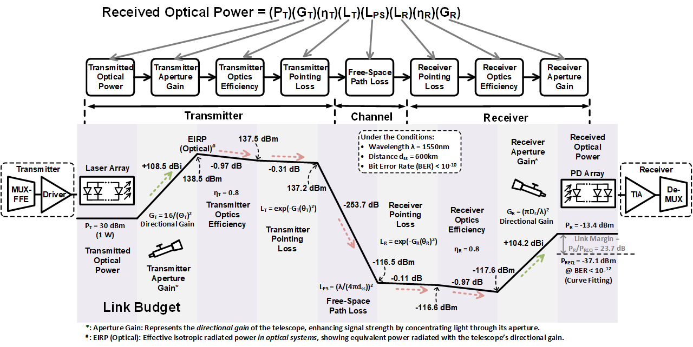
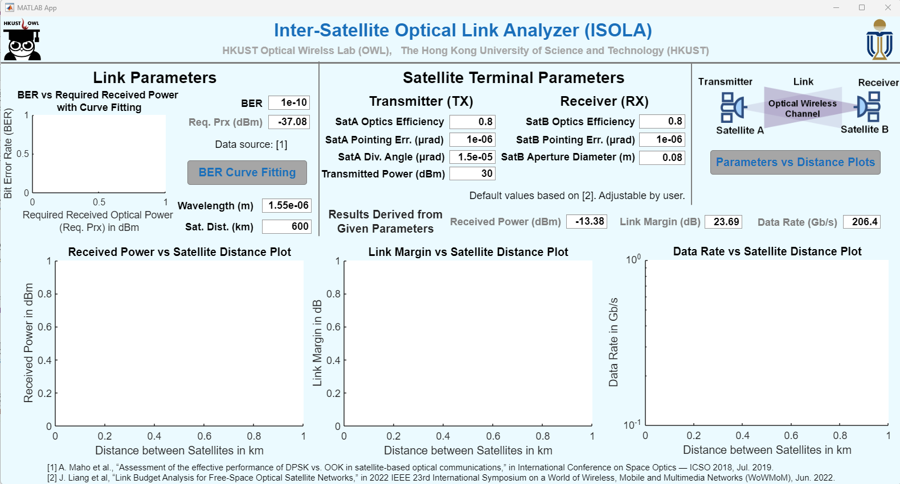
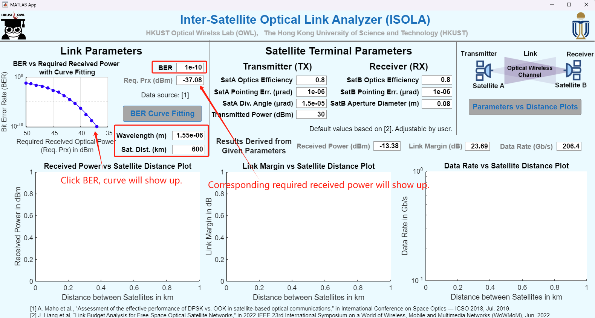
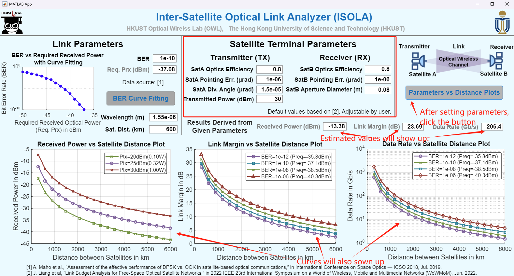

# Inter-Satellite_Optical_Link_Analyzer_ISOLA

Supervised by Professor C. Patrick Yue, we developed this Inter-Satellite Optical Link Analyzer (ISOLA) for practical satellite communications.

## 1. Motivation
The ISOLA is based on the detailed modeling of link budget analysis as shown below.

## 2. Environment Requirement
* MATLAB 2019b or newer version

## 3. Tutorial for the ISOLA
The following steps show an example of how to use the ISOLA platform step-by-step. 

Step 1. Download all files in "MATLAB Files", and unzip them into the same folder.

Step 2. Open Matlab 2019a (or later). Go to ‘MATLAB Files’ folder, Select and run ‘InterSatellite_Optical_Link_Analyzer_ISOLA_GitHub.mlapp’. 

Step 3. Setup the link parameters in GUI according to your requirements, such as required received power, link distance, etc. And then click the 'BER Curve Fitting' icon. After the curve appears, the corresponding required optical power at the receiver is displayed on the GUI (left part on the GUI). The following figure (left part) shows an example.

Step 4. Set up the terminal parameters in GUI according to the specifications, such as pointing error, transmitted optical power, aperture size, etc. And then click the 'Parameters vs Distance Plots' icon. Then three plots and the performance results derived from the model will shown in the window as follows.

 
Step 5. Now you can replace your own design to the example project for the ISOLA!

For more information, please contact us at: sfengan@connect.ust.hk
